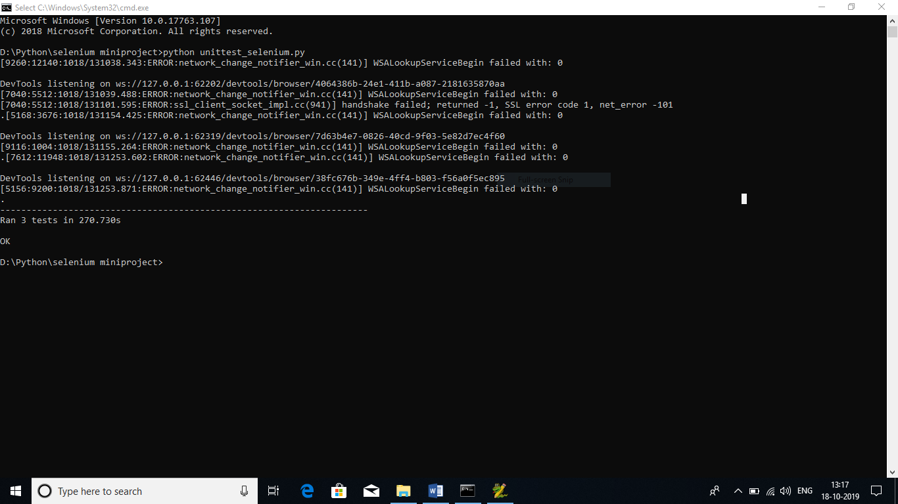

# Testing-google-website-using-Selenium-Unittest
practicing selenium with google website testing

Steps to follow:
1. download chromedriver(version: suitable with your browser) from: https://chromedriver.chromium.org/downloads
2. Keep both chromedriver and unittest_selenium.py in same directory(folder).
3. Install packages from requirements.txt.
4. Run unittest_selenium.py
5. Done

Output:

